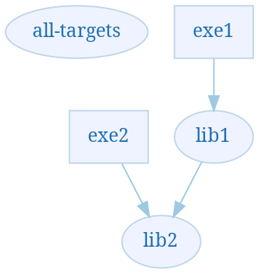

<a id="top"></a>

# project_dependencies_viz

<!-- START doctoc generated TOC please keep comment here to allow auto update -->
<!-- DON'T EDIT THIS SECTION, INSTEAD RE-RUN doctoc TO UPDATE -->


- [Introduction](#introduction)
  - [Feedback welcome](#feedback-welcome)
- [Motivation](#motivation)
  - [Why bother?](#why-bother)
  - [Why SVG output?](#why-svg-output)
- [Generating your own interactive dependency images](#generating-your-own-interactive-dependency-images)
  - [The 'sample' project](#the-sample-project)
  - [Basic Steps](#basic-steps)
    - [Adding hyperlinks to nodes in .dot files](#adding-hyperlinks-to-nodes-in-dot-files)
    - [Converting .dot files to .svg](#converting-dot-files-to-svg)
    - [Viewing the .svg files, to see the dependencies](#viewing-the-svg-files-to-see-the-dependencies)
  - [Future exercises](#future-exercises)
    - [Generate .dot files to represent dependencies of your projects](#generate-dot-files-to-represent-dependencies-of-your-projects)
    - [What depends on a particular library?](#what-depends-on-a-particular-library)
    - [Showing more information](#showing-more-information)
- [Alternative approaches - if you use CMake](#alternative-approaches---if-you-use-cmake)
  - [Details of the CMake mechanism](#details-of-the-cmake-mechanism)

<!-- END doctoc generated TOC please keep comment here to allow auto update -->

## Introduction

This is a quick demo of how to use [graphviz](https://www.graphviz.org/) to make interactive SVG files to show dependencies between projects, to help answer a question asked on the [#include <C++> Discord server](https://www.includecpp.org/).

The graphviz .dot files here show a technique of adding [URLs](https://www.graphviz.org/doc/info/attrs.html#d:URL) to nodes in a graph. When the output is .svg, the nodes are then hyper-linked, and provided easy navigation.

A second section shows how you can achieve a similar effect more easily, if your builds are driven by CMake.

### Feedback welcome

I'd love to have feedback on this - feel free to use the Issues system in this repo, or [Twitter](https://twitter.com/ClareMacraeUK).
 
Are there any better mechanisms that already exist to show project dependencies in large bodies of C++ code?

Has anyone already done the work of adding URLs to make the CMake output `--graphviz` output files interactive?

## Motivation

### Why bother?

The examples I use here are tiny projects, for brevity. But these approaches are really useful when you have much larger volumes of code, typically divided up into dozens or hundreds of smaller projects.

I used the first approach repeatedly on a system with several million lines of C++ code, for several major refactorings.  

Example reasons why you might want to see dependencies between your projects:

* To understand the dependencies between targets (libraries or executables) in your builds
* To explain the structure of your code to a colleague
* To spot dependencies that don't make sense, in order to remove them
* To plan project-restructuring exercises
* To help divide up libraries that have become large
* To speed up parallel builds by removing unnecessary dependencies between targets,  

### Why SVG output?

Aside from the hyperlinking benefits I describe below, I found these benefits of using the [SVG format](https://en.wikipedia.org/wiki/Scalable_Vector_Graphics) to visualise complex dependencies:

* The files load very quickly into browsers like Chrome and Vivaldi - much quicker than corresponding bitmap images
* Because the SVG files are text, you can use the Browser's Search feature (`Ctrl + F`) to easily search for text in the image
* The images scale very nicely when zooming in and out of large files
* Some browsers allow you to hold down the shift key and then drag with the mouse to pan in all directions around the image 

## Generating your own interactive dependency images

### The 'sample' project

The images here represent the dependencies in a fictional, simple system, consisting of:
 
* two libraries ('lib1' and 'lib2') - drawn as ovals 
* two programs ('exe1' and 'exe2') - drawn as rectangles


* the arrows show project dependencies 
* 'all-targets' is a special link that loads the full dependency image - which is what is shown above. This will make more sense after reading the section on viewing the dependencies.

### Basic Steps

The following sections show the essential steps needed to make this work, if you are writing your own mechanism to browse your project dependencies.

For brevity, I'm not explaining every graphviz dot construct used here - just the bits for adding hyperlinks.

Wikipedia gives a simple introduction to the [dot language](https://en.wikipedia.org/wiki/DOT_(graph_description_language\)), and there is also the [graphviz documentation](https://www.graphviz.org/documentation/).

#### Adding hyperlinks to nodes in .dot files

The dot file used to create the image above is this, copied from [all-targets.dot](all-targets.dot):



This is a pretty standard .dot file. It's the `URL` node attributes that make dot add hyperlinks to the nodes, e.g. in this line, which means that clicking on the rectangle labelled `exe2` will make the browser load the file [`exe2-uses.svg`](exe2-uses.svg):

`"exe2" [shape="box" URL="exe2-uses.svg"];`


See the [documentation for the URL attribute](https://www.graphviz.org/doc/info/attrs.html#d:URL), which is worth reading for important notes like the node needing to be filled for this to work well in SVG output, and which other output formats support URLs. It also has links to the attributes to use for adding hyperlinks to the various bits of graph edges.

#### Converting .dot files to .svg 

Example command to create the file `all-targets.svg` from `all-targets.dot`

```bash
dot -Tsvg all-targets.dot -o all-targets.svg
```
The Python 3 script [dot_convert.py](dot_convert.py) does this conversion for all .dot files in the current directory. It requires graphviz's `dot` command to be in the path.

#### Viewing the .svg files, to see the dependencies

Web browsers like Chrome and Vivaldi work make it really easy to view these files, with working hyperlinks. Firefox is fine too, but has the limitation that holding down the Shift key doesn't enable panning.

I found two approaches to provide access to the generated .SVG files:

1. Somehow share the folder that the files are in
2. Or put them in a folder that can be viewed via an HTTP server

So, to navigate the dependencies in my sample project, do one of these:

1. Get the files from github:
    * download or clone [this repo](https://github.com/claremacrae/project_dependencies_viz)
    * Open `all-targets.svg` in a browser
2. View the files via a web server, see [all-targets.svg](https://claremacrae.co.uk/images/project_dependencies/all-targets.svg).

Now you've got `all-targets.svg` loaded, try these steps:

1. Load the file 'all-targets.svg into a modern browser - Chrome, for example
2. Click on  'exe1'
3. The file 'exe1-uses.svg' will load - showing only things that 'exe1' uses:


You can click on 'all-targets' to get back to the initial view.

### Future exercises

#### Generate .dot files to represent dependencies of your projects

These .dot files were hand-edited, for demo purposes. The intention here is to show how information in one's own build system could be presented in an easily navigable way.

#### What depends on a particular library? 

At a previous job, I wrote scripts to generate files like this from information in the project build system. It had one really useful extra feature, which is that you could also see what targets depended on a given library.

This was really helpful in understanding what code would have to be rebuilt, if a particular library was modified.

It also made the images much easier to navigate, as you could easily drill down to lower level libraries, and then navigate back up again.

In my first implementation, clicking repeatedly on a library node alternated between:

1. showing what the library used
2. showing what used the library

This was a bit non-obvious to users, so I then switched to adding extra nodes near the 'all-targets' node that hyper-linked to the two related images. 

#### Showing more information

I also added colour-coding to the images, for different types of libraries, with categories such as:

* targets that depended on Qt
* 3rd-party libraries
* targets that depended on libraries that they should not have done

I then added a colour-key link to each image. 

## Alternative approaches - if you use CMake

If you use CMake to drive your builds, and you just want to see a single image of all your project dependencies, you can use CMake's own option `--graphviz`.

Taking [ApprovalTests.cpp](https://github.com/claremacrae/ApprovalTests.cpp/) as an example:

```bash
cd ApprovalTests.cpp
mkdir cmake-build-dot
cd    cmake-build-dot
cmake --graphviz=test.dot ..
dot -Tsvg test.dot -o test.svg
```

The generated .dot file can be seen [here](cmake-generated-files/test.dot).

And the [generated .svg](cmake-generated-files/test.svg) file looks like this:


### Details of the CMake mechanism

There is an [overview of the CMake graphviz output mechanism](https://gitlab.kitware.com/cmake/community/wikis/doc/cmake/Graphviz) on the Cmake wiki.

And there is much [more detail in the the CMake documentation](https://cmake.org/cmake/help/latest/module/CMakeGraphVizOptions.html), showing how you can control what types of targets are included in the output, and how to control the node and edge styles.

This documentation page describes the many separate files that CMake writes out.

It says:

> When CMake is run with the --graphviz=foo.dot option, it will produce:
> * a `foo.dot` file showing all dependencies in the project
> * a `foo.dot.<target>` file for each target, file showing on which other targets the respective target depends
> * a `foo.dot.<target>.dependers` file, showing which other targets depend on the respective target

This means that if you use CMake, and if you spend time post-processing the CMake graphviz output to add URL attributes, you could probable answer my "What depends on a particular library?" question above, for your projects, really quite quickly.
